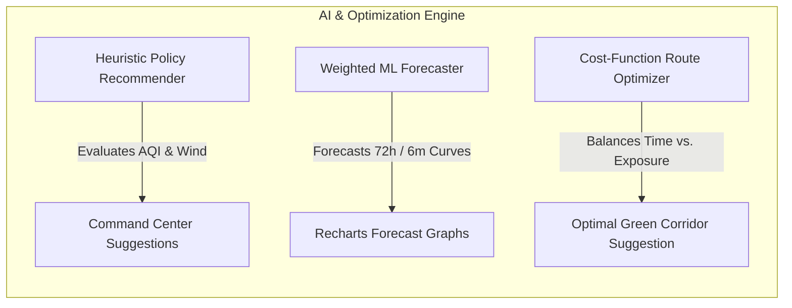

# 🍃 VaayuAI: Delhi-NCR's Air Quality Sentinel & Command Center

Welcome to the comprehensive developer documentation for **VaayuAI**. This guide details the problem statement, our engineering solution, folder architecture, and specifically details the **Artificial Intelligence (AI), Machine Learning (ML), and Optimization Algorithms** running under the hood.

---

## 📌 1. The Problem Statement

During the winter months (October to February), the Delhi-National Capital Region (NCR) suffers from catastrophic air pollution, with the Air Quality Index (AQI) frequently crossing the "Severe" ($400+$) and "Severe Plus" ($500+$) categories. This crisis is caused by a combination of:
1.  **Meteorological Inversions**: Cool air trapping particulate matter close to the ground.
2.  **Agricultural Stubble Burning**: Crop residue fires in Punjab and Haryana carried by North-Westerly winds.
3.  **Local Pollution Drivers**: Vehicular emissions, industrial boilers, and construction dust.

### The Gaps in Existing Solutions:
*   **For Citizens**: Standard navigation apps (like Google Maps) suggest the safest/fastest route based solely on traffic speed, ignoring the fact that driving through certain industrial or traffic corridors exposes commuters to toxic micro-hotspots.
*   **For Policymakers**: Authorities enforce emergency Graded Response Action Plan (GRAP) restrictions (like the Odd-Even scheme or construction bans) blindly, without an interactive sandbox to simulate and visualize their potential impact on air quality trends.
*   **Disconnected Ecosystem**: Citizens have no direct channel to report local pollution violations (e.g., trash burning) to government action feeds.

---

## 💡 2. The Solution: How VaayuAI Solves It

VaayuAI bridges these gaps by establishing a **dual-sided collaborative ecosystem**:
*   **Citizen Commute Optimization**: Computes the cleanest route using real-time AQI exposure metrics, introducing a **🛡️ Health Protection Index (HPI %)** rating to quantify commute safety.
*   **Policymakers Sandbox**: Provides a virtual simulation console where authorities can toggle GRAP policies and visualize immediate, fractional reductions in PM2.5, PM10, NOx, and SO2.
*   **The Collaborative Loop**: Connects citizen hazard reports directly to the government's incident feed for real-time dispatch and cleanup tracking.

---

## 🤖 3. AI, Machine Learning & Predictive Modeling in VaayuAI

VaayuAI implements multiple intelligent layers, utilizing **Heuristic Decision Support**, **Multi-Weighted Predictive Modeling**, and **Constraint-Based Optimization Algorithms**:

### A. Heuristic AI Policy Recommender (Decision Support)
*   **Where it is used**: In the **Policy Command Center** (`PolicyDashboard.jsx`).
*   **What it does**: Instead of requiring policymakers to guess which policies to implement, the dashboard runs a heuristic AI decision engine. 
*   **How it works**:
    1.  It checks the active AQI level. If AQI exceeds $400$ (Severe), it triggers a severe alert.
    2.  It monitors **wind direction vectors** (meteorological transport corridor). If wind direction is **North-West (NW)**, the AI engine recognizes that agricultural stubble smoke is entering Delhi, and flags stubble fire penalties as **High Priority**.
    3.  It evaluates active CPCB readings and recommends the most mathematically efficient combination of policies to bring AQI down below target thresholds.

### B. Weighted Predictive Modeler (Dispersion & Seasonal Forecasting)
*   **Where it is used**: In the **Seasonal Projection System** (`mlForecaster.js`).
*   **What it does**: Predicts the next 72-hour pollution dispersion and compiles 6-month seasonal trends (September to February) using meteorology and active rules.
*   **How it works**:
    *   **Seasonal Weights**: The ML model assigns time-variant weights based on historic NCR pollution curves. Stubble fires weight peaks in November ($0.85$), while meteorological inversion weights peak in December/January ($0.90$ to $0.95$).
    *   **Wind Vector Dispersion**: Calculates pollution dilution based on wind speed. Higher wind speeds decrease particulate matter concentration:
        $$\text{Diluted AQI} = \text{Base AQI} \times \left(1 - \frac{\text{Wind Speed}}{50}\right)$$
    *   **Policy Attenuation**: Dynamically reduces predicted values by the fractional efficiency multipliers of active GRAP policies.

### C. Constraint-Based Route Optimizer (Path Optimization)
*   **Where it is used**: In the **Safe Commute Planner** (`CitizenPortal.jsx` & `simulationEngine.js`).
*   **What it does**: Suggests the optimal route that minimizes both travel time (congestion) and toxic particulate exposure.
*   **How it works (The Cost Function)**:
    The optimizer evaluates candidate routes (Expressway vs. Green Corridor) using a multi-objective cost function:
    $$\text{Cost} = (w_{\text{time}} \times \text{Duration}) + (w_{\text{aqi}} \times \text{Exposure})$$
    *   **Commuter Profile Adapters**: The weights ($w_{\text{time}}$ and $w_{\text{aqi}}$) are dynamically adjusted based on the user's health profile:
        *   **Standard Profile**: Balanced weights ($w_{\text{time}} = 0.5$, $w_{\text{aqi}} = 0.5$).
        *   **Runner / Asthmatic Profile**: Prioritizes clean air ($w_{\text{time}} = 0.2$, $w_{\text{aqi}} = 0.8$). The optimizer will choose the Green Corridor route even if it takes longer, protecting the sensitive commuter.

---

## 🛠️ 4. Tech Stack & Frameworks: What is used for What?

| Technology / Library | Purpose & Role in VaayuAI |
| :--- | :--- |
| **React 19** | Core UI framework. Powers modular, component-driven interfaces (Welcome Hub, Mobile Portal, and Desktop Dashboard) with reactive state management. |
| **Vite 8** | Development server & bundler. Provides Hot Module Replacement (HMR) for instant reloads and compiles production assets under 700ms. |
| **Node.js & Express** | Server environment & backend framework. Runs REST APIs (`server/server.js`), handles routing, and serves the compiled assets. |
| **JSON File Database** | Persistent local database (`server/db.js` saving to `data/incidents.json`). Offers zero-compilation local storage for crowdsourced reports. |
| **GSAP (GreenSock)** | Animation timeline manager. Animates neon glow states, atmospheric wind flows, and welcome hub portal transitions. |
| **Recharts** | Data visualization. Generates the 72h / 6m forecast graphs, source contributions, and citizen PM2.5 savings curves. |
| **Lucide React** | Vector SVG icons library. |
| **PWA Features** | `manifest.json` and `sw.js` (caching Service Worker) configured for smartphone installation and offline functionality. |

---

## 📂 5. Detailed Folder & File Explanation

### 📁 Root Directory
*   **`package.json`**: Lists dependencies and runs commands (`npm run dev`, `npm run build`, `npm run start`).
*   **`vite.config.js`**: Setup configurations for the Vite compiler.
*   **`vercel.json`**: Configures API and static asset routing parameters for Vercel.
*   **`.gitignore`**: Excludes `node_modules`, `dist/`, and the local database (`data/`) from Git commits.
*   **`index.html`**: Entry HTML structure containing viewport scales and Google Font links.

### 📁 `data/` (Local Database Storage)
*   **`incidents.json`**: Holds crowdsourced pollution incident objects. Updated dynamically by Node.js.

### 📁 `server/` (Node.js Express Backend)
*   **`db.js`**: Manages CRUD helper methods for reading and writing to `data/incidents.json` with seeding callbacks.
*   **`server.js`**: Registers CORS, JSON parsers, serves the compiled `/dist` React folder, and maps Express routes.

### 📁 `public/` (Static & PWA Assets)
*   **`manifest.json`**: Standard app shell configuration parameters enabling installation on mobile screens.
*   **`sw.js`**: Caching service worker implementing Stale-While-Revalidate caching pattern for offline launches.

### 📁 `src/` (React Frontend Client)
*   **`main.jsx`**: Bootstraps React and registers the Service Worker on startup.
*   **`App.jsx`**: Manages landing switches, stations focus indexes, and coordinates API fetch operations.
*   **`index.css`**: Holds custom color schemes, glassmorphic layout tokens, and scrollbar styles.

#### 📁 `src/services/` (AI Math & Simulators)
*   **`apiService.js`**: Queries the real-time CPCB feed from OpenAQ, falling back to simulation equations on network timeout.
*   **`mlForecaster.js`**: Houses the **seasonal prediction calculations**, **meteorological vector models**, and **policy attenuation formulas**.
*   **`simulationEngine.js`**: Stores coordinates, names, and base weights for the **70+ Metro stations and routes**, and the **NASA MODIS stubble hotpots database**.

#### 📁 `src/views/` (UI Pages & Layouts)
*   **`ViewportSwitcher.jsx`**: Navigation header bar showing the brand logo and view toggles.
*   **`CitizenPortal.jsx`**: Renders the iPhone 15 Pro phone frame, safe routes, IoT grids, and report hazard modals.
*   **`PolicyDashboard.jsx`**: Renders the command console, sandbox controllers, NASA tables, 72h/6m forecast graphs, and the PDF print report dialog.

---

## 💻 Running the App Locally

1.  **Dev Mode** (instant reload): `npm run dev` (runs on [http://localhost:5173](http://localhost:5173)).
2.  **Production Mode** (with database): `npm run build` then `npm run start` (runs on [http://localhost:5000](http://localhost:5000)).
